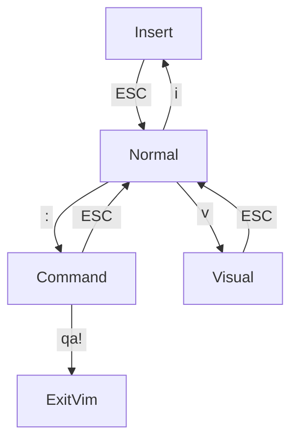
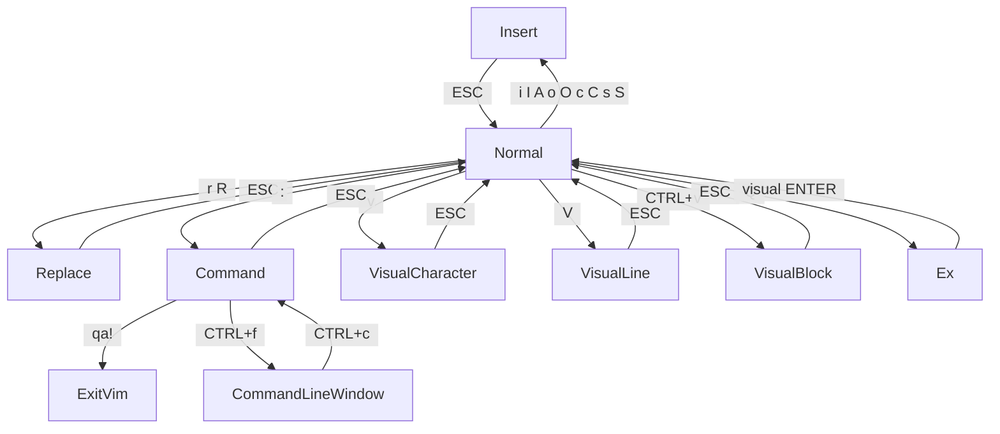

# learn_vim
The most important information:

[How to exit vim](#exit-vim)

[How to pair with someone who uses vim](#how-to-pair-with-someone-who-uses-vim)

The following should work for neovim, vim, vi, and vim plugins for other editors too. But I'll use vim to refer to all of them.

## Getting started

The easiest option is to add vim mode to whatever editor or IDE you're currently using.
That way you learn vim at your own pace, and are less likely to get overwhelmed: eg, 
[vscodevim](https://marketplace.visualstudio.com/items?itemName=vscodevim.vim) or
[IdeaVim](https://www.jetbrains.com/help/idea/using-product-as-the-vim-editor.html).

If you want to dive into the deep end and try it as your main editor, follow these steps to setup neovim:
[nvim-lua/kickstart.nvim](https://github.com/nvim-lua/kickstart.nvim)

## A Modal editor

Other editors default to entering text. This makes sense at first, surely the most important thing is typing text in an editor?

But in vim, you default to giving the editor actions, then switch modes to enter text. The idea is that *editing* text is the more important part. You *edit* text by naviating around a document and modifying the existing text.

So for example in vscode to modify the next two words, you might:

- hold SHIFT + hold OPTION + press right arrow twice to select 2 words
- then type the replacement text, overwriting the selected text

Instead of thinking of the first step as a key combination, you can think of each modifier key you hold down as temporarily switching to a different mode.
- SHIFT changes to selecting text mode.
- OPTION changes arrows to move by words rather than characters.
- Once you release these modifier keys, you're back to entering text.

In vim you're always in a specific mode, and you explicitly switch between them.
In vim to modify the next two words, you might:

- type `c2w`
- then type the replacement text
- then press ESC to switch back to Normal mode

The `c` part switches modes, so you can type out the replacement text.
The `2w` part indicates what text you want to modify.
As you type out the above, vim waits until you've finished typing a whole action, then executes it all at once.
It has a specific grammar for actions, so it doesn't need to wait a specified amount of time or for an ENTER.

I chose this example as there's the same number of key presses for both approaches.
So it shows the main difference with the vim approach:

You type a sequence of individual keys, rather than holding keys down in combination.

I find this more comfortable, not necessarily any faster.
There are combinations using CTRL in vim, but they're less common.

Vim has various modes, with each mode being used for different kinds of tasks.

## Normal Mode
Normal mode is your home base, and you'll go into other modes from here.

It's used for navigation and editing text. You can't actually type text in this mode, which will seem strange at first. But for coding, this is actually the most useful mode. That's why it's called normal mode.

Actions in normal mode are typed out normally and do not require ENTER to run.

In other editors, you hold down combinations of Control,Shirt,Option, Command, and other keys to do these sorts of actions.

From other modes:

`ESC` to get back to Normal mode.

### The vim language

The power of Normal mode is that actions are built using a simple grammar.

`<verb><noun>`

Verbs are things like `d` for delete, `y` for yank (copy), `c` for change. They are often called operators.

Nouns are things like `w` for word, `s` for sentence, `l` for line.

eg `dw` means delete to the start of the next word.

If you don't provide a verb, the verb is implicitly move. So these are often called motions.

`<noun>`

eg `w` means move to the start of the next word.

A noun can be plural, by adding a count prefix.

eq `2w` means move 2 words.

eq `d2w` means delete two words.

You can also add a count to the verb.

eg `2dw` means delete word twice. Which does the same thing as `d2w`.

Basic navigation is treated as a noun.

eg `c10j` means to change the next 10 lines down (`j` is the down key).

Some motions may require a parameter. In this example `fp` is the motion.

eg `dfp` means do delete until you find the next "p" character.

Some nouns need additional context, like `a` for around. They don't move the cursor, so they're called text objects.
Because they don't move the cursor, they can be done from any part of that context. In this example `ap` is the text object.

eg `yap` means to copy around the current paragraph, both above and below the cursor.

Some motions also have related text objects.

eg `daw` deletes around the word, while `dw` deletes the rest of the word.

So you could describe the grammar in more detail this way.

`<count><optional verb><count><motion>`
or
`<count><verb><count><text_object>`

The count is always optional, and it's up to personal preference where you want to use it.
You can even multiply them.

eg `2d3w` will delete the next 6 words.

As you learn more verbs and motions you can combine them with the ones you already know.
And as you use them, you'll start to think in terms of these higher level actions.

So you might want to modify the text inside the next set of parentheses.
Which can be done with `ci(`, change inside parentheses.

You combine separate actions by just typing them one after the other.
So say you want to move the current block to the end of the file.
Which can be done with `dapGp`, delete around paragraph, go to the end of the file, paste.

Or you might want to change all the text up to a certain word.
Which can be done with `c/foo<ENTER>`, change until the next "foo" word.

In this way, vim provides a whole language to think in for editing text.

And those thoughts can be directly actioned.

### Terminology

Some of the terms vim uses for basic ideas can seem odd.
These names generally come from the keys that are used.
So for example instead of cut and copy, there's delete and yank.

| Concept         | Vim Name               | Keys       |
|-----------------|------------------------|------------|
| cut or delete   | Delete                 | `d` `D`    |
| copy            | Yank                   | `y` `Y`    |
| paste           | Put                    | `p` `P`    |
| edit            | Change                 | `c` `C`    |
| edit            | Insert                 | `i` `I`    |
| edit            | Append                 | `a` `A`    |
| selection       | Visual                 | `v` `V`    |
| overwrite       | Substitute             | `s` `S`    |
| overwrite       | Replace                | `r` `R`    |
| newline         | Open                   | `o` `O`    |
| undo            | Undo                   | `u`        |
| redo            | Redo                   | `Ctrl-r`   |
| save            | Write                  | `:w`       |
| quit            | Quit                   | `:q`       |
| word            | Word                   | `w` `W`    |
| word            | End of word            | `e` `E`    |
| previous word   | Backwards word         | `b` `B`    |
| find char       | Find char              | `f` `F`    |
| find char       | Til char               | `t` `T`    |
| next match      | Next                   | `n` `N`    |
| navigation      | Go                     | `g` `G`    |
| bookmark        | Mark                   | `m`        |

The capitalized letter for a term has a few possible meanings:
- reversing the direction
- operating on a line
- expanding the scope

### Motions and navigation

Just moving around vim can be confusing at first.

`h j k l` are the arrow keys, left, down, up, right. Which is pretty strange, but they're right on the home row.

There's all kinds of other ways to move around.

`$` to move to the end of the line.

`0` to move to the start of the line.

`^` to move to the first non-whitespace character of the line.

`{ }` to move to the start of the previous/next paragraph.

`w b` to move by forwards and backwards by a word, defined by punctuation.

`W B` to move by word, defined by spaces.

`%` to move to the matching bracket/braces/parens.

`*` find the next occurrence of the current word.

`/` search using regex.

## Other modes

Here are the basics for switching between modes.

### Insert
Used for actually typing text.

From Normal mode: `i` to switch to Insert mode.

### Command
Used for giving the editor commands.
Things like saving, quiting, opening files or enabling options.

It shows a `:` in the bottom left, and you type out the command then press ENTER to run it.

In other editors, you often use a menu, or a command palette with Command+Shift+p to run these commands.

From Normal mode: `:` to switch to Command mode.

#### Search
Used for searching for text using regex.
It's a form of Command mode that will show a "/" in the bottom left and say "Command" above that.

From Normal mode: `/` to switch to Search mode.

Then type the text you want to search for, and press ENTER.
then use `n` to find the next match, or `N` to find the previous match.

While search can be seen as a mode, it also counts as a motion.
So `y/bar<ENTER>` will yank until the next match for 'bar'

### Visual
Used for selecting text.
This allows you to use the same keys as Normal mode.
In other editors, you use the mouse to drag and select things, or hold down shift as you select the text.

From Normal mode: `v` to switch to visual mode by character.

Then navigate around with Normal mode to select text. Then perform a verb like `d` for delete.

So the grammar for visual mode is a little different.

`v<normal mode motions><verb>`

Any number of motions can be used while in visual mode.
Even `/` search can be used.

### More ways to switch modes

There are even more ways to switch modes, and variations on the above modes.

When there are multiple options, they are separated with a space.
eg `i o` means either "i" or "o"

### More ways to Insert

`i` to enter text before the cursor.

`I` to enter text at the start of the line.

`A` to enter text at the end of the line.

`o` to enter text in a new line below.

`O` to enter text in a new line above.

`c` to change text.

`C` to change the rest of the line.

`s` substitute starting with the next character.

`S` substitute the whole line.

### Visual line and block
Visual mode is by character, but it can also be by whole lines, or a block.

From Normal mode:

`v` to switch to visual mode by character.

`V` (`SHIFT+v`) to switch to line visual mode.

`CTRL+v` to switch to block visual mode.

### Replace
Similar to Insert mode, but replaces existing characters. Like [overtype mode when you hit the 'Insert' key.](https://en.wikipedia.org/wiki/Insert_key)

### Special Modes
You'll probably want to avoid these.

#### Command Line Window

Used to edit your history of commands, allowing you to use Normal mode keys to navigate and edit the commands.

When in Command mode `CTRL+f` to switch to Command Line Window mode.

It will show a colon ":" and say "Normal".

Edit your command, then hit ENTER to execute that command.

`CTRL+c` to exit this mode. Then press ESC to get back to Normal mode.

#### Ex
Emulates the very old "ed" editor. I have not found a use for this mode myself.

`Q` to switch to Ex mode.

It will show a colon ":", but ESC doesn't work.

You'll see a colon, type visual then press ENTER, to exit this mode.

## Mouse usage

You can still use your mouse for most things, but it you may need to configure it.
But you'll probably find yourself using it less than in other editors.

## Customization

One of the benefits of vim and especially neovim editors, is the deep level of customization you can do.
You can change virtually any key, appearance, or behaviour you want.

There are all kinds of plugins available, include [LSP](https://github.com/neovim/nvim-lspconfig) and [DAP](https://github.com/mfussenegger/nvim-dap) which provide the same kind of features as in vscode.

And configuring your setup is only a very small step from writing your own plugins, as plugins are written in the same vimscript or lua as your configuration.

## vim tutor
in vim press Escape, then type:
`:Tutor`

## How to pair with someone who uses vim
Ask them to enable the arrow keys, so you can do basic navigation,

Ask them to enable the mouse, so you can scroll and click around.

And ask them to enable the operating system clipboard, so you can copy and paste with other programs.

Here are the most basic keys to get started with:

`ESC` back to normal mode

`i` to actually enter text

`v` for selecting text

`d` to cut

`y` to copy

`p` to paste

`u` undo

`CTRL+r` redo

`:w` save

`:e filename` to edit a file

## Exit vim
Quiting vim can be the most confusing part to start with.

Vim has multiple modes, so depending on which mode you're in you might need to try a few options to exit.

`ESC` press the Escape key. At the bottom left it should say "Normal".

`:` press the colon key. You should see a colon in the bottom left. It should say "Command" just above the ":".

`qa!` type "qa!" then press ENTER. This will quit all windows without saving.

If none of that works, try:

`CTRL+c` If you see the colon, and it also says "Normal".

`CTRL+z` if you're really stuck you can suspend vim and go back to the terminal.

## Related Links
[ Vim Survival Guide ]( https://www.fusionbox.com/blog/detail/vim-survival-guide/609/ )

[Learning Vim in 2014: Vim as Language](https://benmccormick.org/2014/07/02/062700.html)

[Your problem with Vim is that you don't grok vi.](https://stackoverflow.com/questions/1218390/what-is-your-most-productive-shortcut-with-vim/1220118#1220118)
