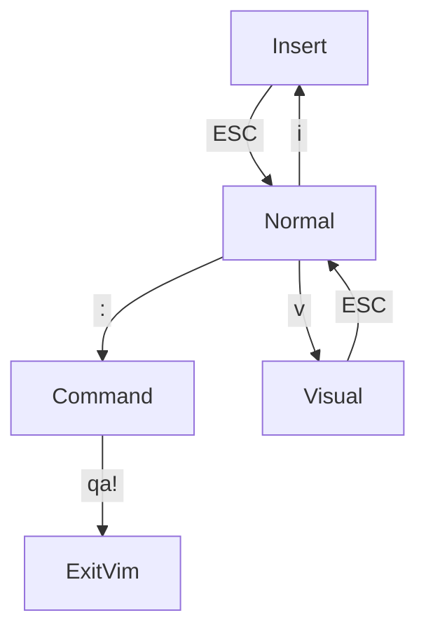
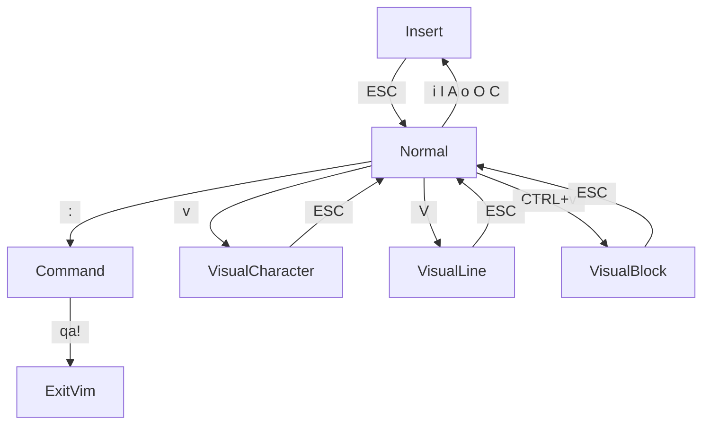

# learn_vim
Resources for learning vi/vim/neovim editors and vim modes in other editors.

## Exit vim
Quiting vim can be the most confusing part to start with.

Vim has multiple modes, so depending on which mode you're in you might need to try a few options to exit.

`ESC` press the Escape key. At the bottom left it should say "Normal".

`:` press the colon key. You should see a colon in the bottom left. It should say "Command" just above the ":".

`qa!` type "qa!" then press ENTER. This will quit all windows without saving.

If none of that works, try:

`CTRL+c` If you see the colon, and it also says "Normal".

`CTRL+z` if you're really stuck you can suspend vim and go back to the terminal.

## Key
`CTRL+c` means hold down the Control key and press c.

`SHIFT+c` means hold down the Shift key and press c, same as typing a capital C.

`ESC` means press is the escape key.

`ENTER` means press the ENTER key.

`yaw` means press y, then a, then w.

## Modes

Other editors default to entering text. Then you hold down modifier keys to temporarily perform other actions.

But in vim, you default to giving the editor actions, then switch modes to enter text.

So for example in vscode, to copy 2 words, you might:

- hold SHIFT to select
- hold OPTION to move by word
- press right arrow twice to select 2 words
- then hold CMD then press "c" to copy

In vim, you might:

- type `y2w` to yank (copy) 2 words

Vim has various modes, with each mode being used for different kinds of tasks.

### Basics for switching mode

### Normal
Used for navigation and editing text. You can't actually type text in this mode, which will seem strange at first. But for coding, this is actually the most useful mode. That's why it's called normal mode.

Normal mode is your home base, and you'll go into other modes from there.

In other editors, you hold down combinations of Control,Shirt,Option, Command, and other keys to do these actions.

From other modes:

`ESC` to get back to Normal mode.

### Insert
Used for actually typing text.

From Normal mode:

`i` to switch to Insert mode.

### Command
Used for giving the editor commands.
Things like saving, quiting, opening files or enabling options.

It shows a `:` in the bottom left, and you type out the command then press ENTER to run it.

In other editors, you often use a menu, or a command palette with Control+Shift+p to run these commands.

From Normal mode:

`:` to switch to Command mode.

#### Search
Used for searching for text using regex.
It's a form of Command mode that will show a "/" in the bottom left and say "Command" above that.

`/` to switch to Search mode.

Then type the text you want to search for, and press ENTER.
then use `n` to find the next match, or `N` to find the previous match.

### Visual
Used for selecting text.
This allows you to use the same keys as Normal mode.

In other editors, you use the mouse to drag and select things, or hold down shift as you select the text.

From Normal mode:

`v` to switch to visual mode by character.

## The vim language

The power of Normal mode is that actions are built using a basic grammar.

<optional verb><optional modifier><motion>

eg `w` means move to the start of the next word.
eg `2w` means move 2 words.
eg `d2w` means <delete><two><words>.

So as you learn more verbs and motions you can combine them with the ones you already know.

Verbs are things like `d` for delete, `y` for yank (copy), `c` for change, `u` for undo, `CTL+r` for replace.

Motions are things like `w` for word, `s` for sentence, `l` for line. Or `fp` for find the next "p" character.
Motions can include modifiers, like numbers multiply the motions, or contextual like `a` for around

Motions can also be used without a verb, to just move around.

### Motions and navigation

Just moving around vim can be confusing at first.

`h j k l` are the arrow keys, left, down, up, right. Which is pretty strange, but they're right on the home row.

There's all kinds of other ways to move around.

`$` to move to the end of the line.

`0` to move to the start of the line.

`^` to move to the first non-whitespace character of the line.

`{ }` to move to the start of the previous/next paragraph.

`w b` to move by forwards and backwards by a word, defined by punctuation.

`W B` to move by word, defined by spaces.

`%` to move to the matching bracket/braces/parens.

## More ways to switch modes

When there are multiple options, they are separated with a space.
eg `i o` means either "i" or "o"

### More ways to Insert

`i` to enter text before the cursor.

`I` to enter text at the start of the line.

`A` to enter text at the end of the line.

`o` to enter text in a new line below.

`O` to enter text in a new line above.

`C` to change the rest of the line

### Visual line and block
Visual mode is by character, but it can also be by whole lines, or a block.

From Normal mode:

`v` to switch to visual mode by character.

`V` (`SHIFT+v`) to switch to line visual mode.

`CTRL+v` to switch to block visual mode.

### Special Modes
You'll probably want to avoid these.

#### Command Line Window

Used to edit your history of commands, allowing you to use Normal mode keys to navigate and edit the commands.

It will show a colon ":" and say "Normal".

`CTRL+c` to exit this mode. Then press ESC to get back to Normal mode.

#### Ex
Emulates the very old "ed" editor.

It will show a colon ":", but ESC doesn't work.

`:q` you'll see a colon, type q then press ENTER, to exit this mode.

## Links
[ Vim Survival Guide ]( https://www.fusionbox.com/blog/detail/vim-survival-guide/609/ )

[Learning Vim in 2014: Vim as Language](https://benmccormick.org/2014/07/02/062700.html)

## vim tutor
in vim press Escape, then type:
`:Tutor`
